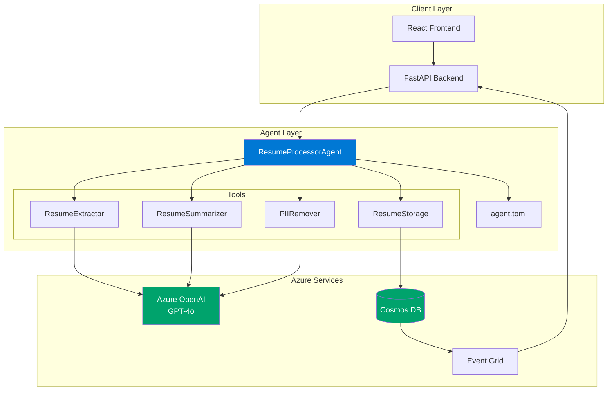
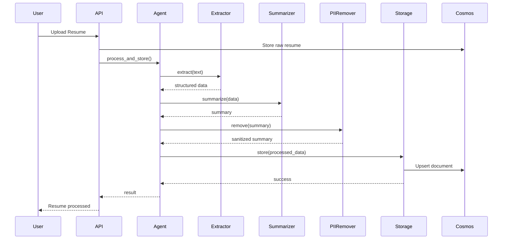

# Resume Processor Agent

Enterprise-grade AI-powered resume processing using the **Microsoft Agent Framework** pattern. Automatically extracts structured data, generates unbiased summaries, and removes PII from resumes.

## Architecture



## Features

| Feature | Description |
|---------|-------------|
| **AI Data Extraction** | Function calling to extract personal info, education, experience, skills |
| **Unbiased Summaries** | Neutral language, extractive summarization |
| **PII Removal** | AI-powered redaction of sensitive information |
| **Role Suggestions** | 10 AI-generated job role recommendations |
| **Event-Driven** | Automatic processing via Azure Event Grid |
| **Managed Identity** | Secure, keyless authentication to Azure |

## Quick Start

### Prerequisites

- Python 3.11+
- Node.js 18+
- Azure subscription with:
  - Azure OpenAI (GPT-4o deployment)
  - Cosmos DB account
  - Event Grid topic (optional)

### 1. Clone & Install

```bash
git clone https://github.com/Scientialibera/LLM-RESUME-PROCESSOR.git
cd LLM-RESUME-PROCESSOR

# Backend
cd backend
python -m venv .venv
.venv\Scripts\activate  # Windows
pip install -r requirements.txt

# Frontend
cd ../frontend
npm install
```

### 2. Configure Environment

```bash
cp .env.example .env
```

Edit `.env`:
```env
AZURE_OPENAI_ENDPOINT=https://your-resource.openai.azure.com
AZURE_OPENAI_API_KEY=your-key  # Or use Managed Identity
COSMOS_DB_ENDPOINT=https://your-cosmos.documents.azure.com:443/
```

### 3. Run

```bash
# Backend (terminal 1)
cd backend
python -m uvicorn app.main:app --reload --port 8000

# Frontend (terminal 2)
cd frontend
npm run dev
```

- **API**: http://localhost:8000/docs
- **Frontend**: http://localhost:5173

## Project Structure

```
LLM-RESUME-PROCESSOR/
 config/
    agent.toml              # Agent configuration
    orchestrator/
        system_prompt.txt   # Agent system prompt
 src/
    orchestrator/
       main.py             # ResumeProcessorAgent
    tools/
        resume/
            extractor.py    # Data extraction tool
            summarizer.py   # Summary generation tool
            pii_remover.py  # PII removal tool
            storage.py      # Cosmos DB storage tool
 backend/
    app/
        main.py             # FastAPI application
        clients/            # Azure service clients
        services/           # Business logic
 frontend/
    src/
        pages/              # React pages
        services/           # API client
 deployment/
     Deploy-AzureResources.ps1
```

## Agent Configuration

The agent is configured via `config/agent.toml`:

```toml
[agent]
name = "ResumeProcessorAgent"
version = "2.0.0"

[model]
provider = "azure_openai"
deployment = "gpt-4o"
temperature = 0.3

[[tools]]
name = "extract_resume_data"
module = "src.tools.resume.extractor"
class = "ResumeExtractor"

[[workflows]]
name = "process_resume"
type = "sequential"
agents = ["extract_resume_data", "generate_summary", "remove_pii", "store_resume"]
```

## API Reference

| Method | Endpoint | Description |
|--------|----------|-------------|
| `POST` | `/api/v1/resumes/upload` | Upload resume for processing |
| `GET` | `/api/v1/resumes` | List all resumes |
| `GET` | `/api/v1/resumes/{id}` | Get resume by ID |
| `POST` | `/api/v1/resumes/{id}/process` | Trigger manual processing |
| `DELETE` | `/api/v1/resumes/{id}` | Delete resume |
| `POST` | `/api/v1/webhooks/eventgrid` | Event Grid webhook |

## Processing Pipeline



## Security

- **Managed Identity**: No API keys in code
- **PII Protection**: All outputs sanitized
- **RBAC**: Least-privilege access to Azure resources

## Deployment

### Azure Container Apps

```powershell
# Deploy infrastructure
cd deployment
.\Deploy-AzureResources.ps1 -ResourceGroupName "rg-resume-processor"

# Build & push
docker build -t resume-api:latest ./backend
az acr login --name <registry>
docker push <registry>.azurecr.io/resume-api:latest
```

## License

MIT
