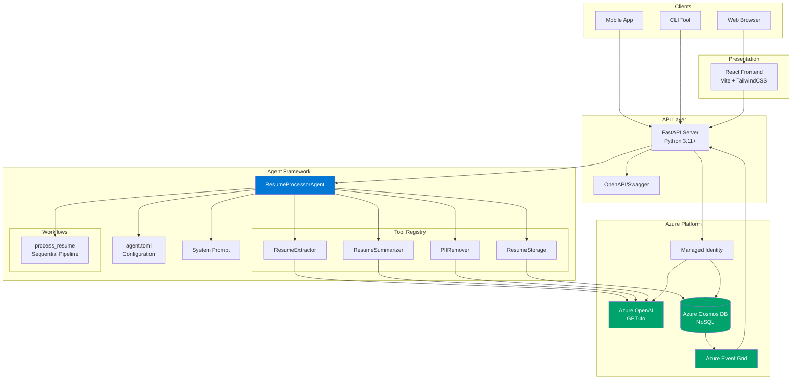
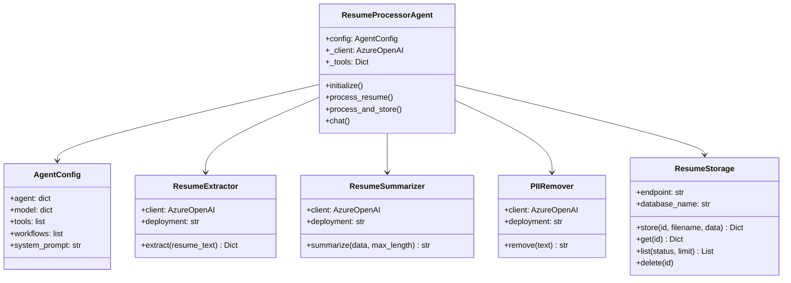
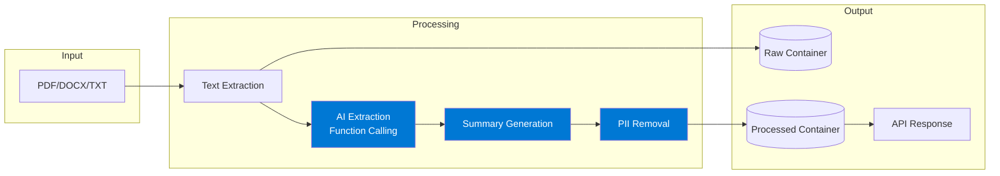
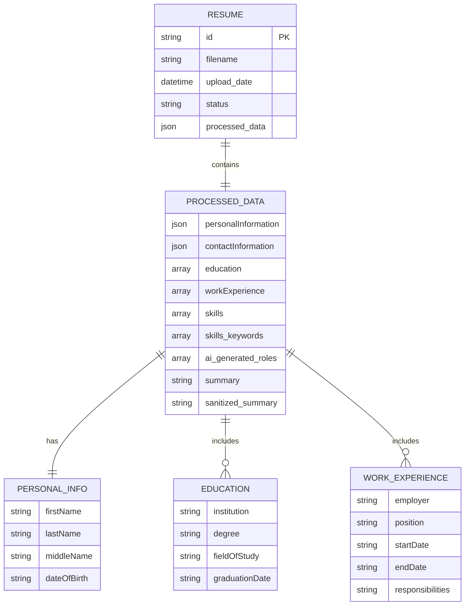
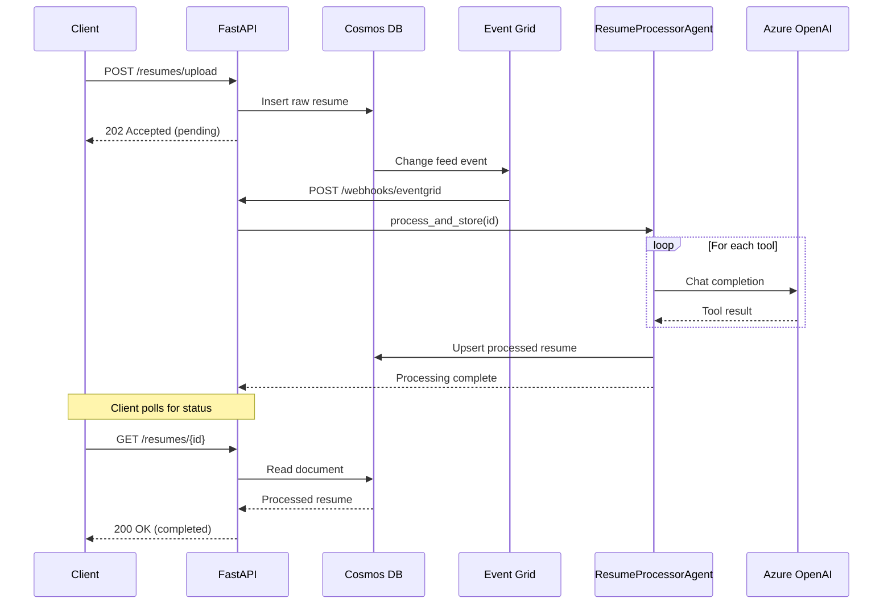
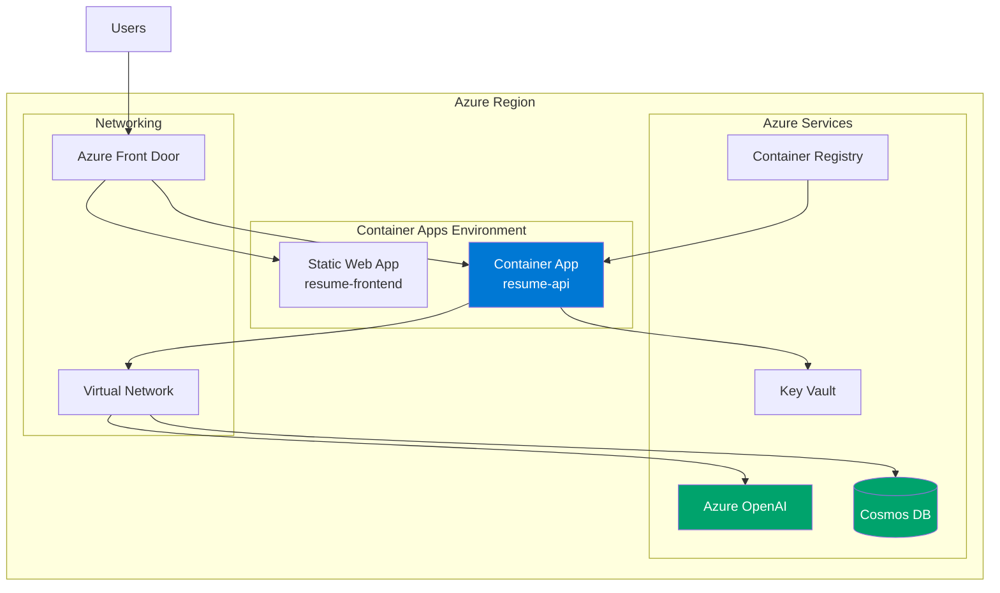

# Architecture Documentation

Detailed architecture diagrams for the Resume Processor Agent.

## High-Level Architecture

## Tool Architecture

## Data Flow

## Extracted Data Schema

## Event-Driven Processing

## Deployment Architecture

